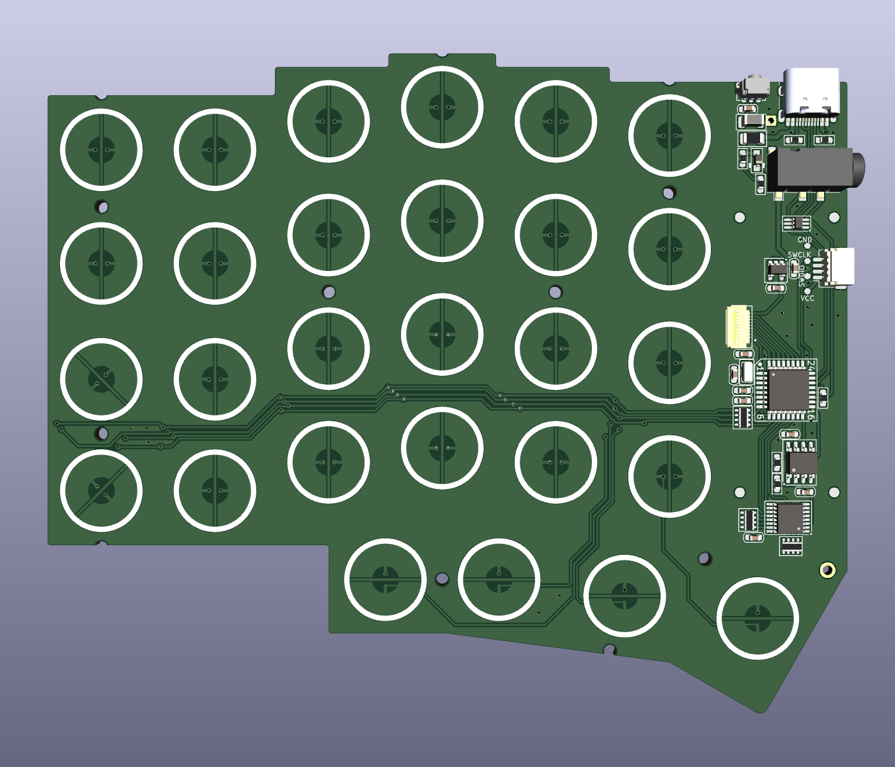
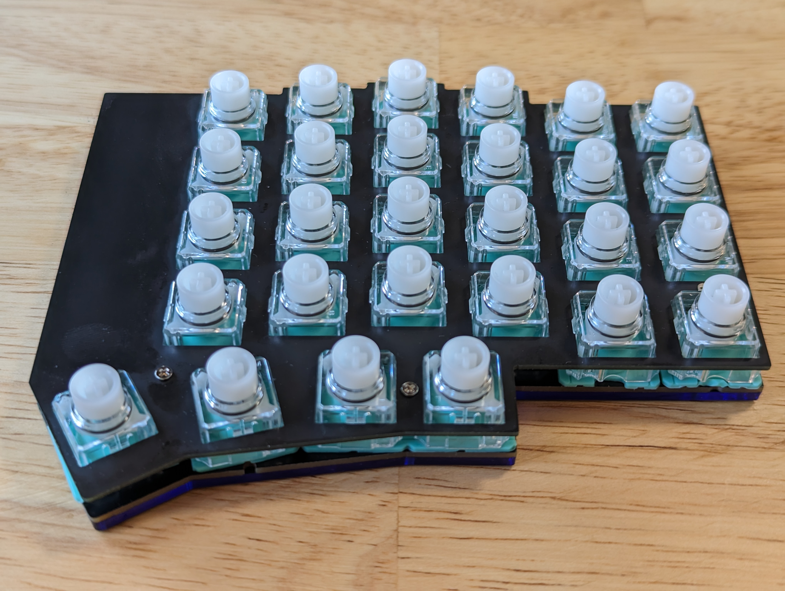

# Corne EEC (Corne Extended Electrostatic Capacitive)
A Corne-based EC keyboard with a number row and one additional thumb key.

**I am not an electrical engineer. The PCB design might not be optimized and could be buggy. Use this project at your own risk.**

## Features
* Corne-like design, but with a number row and 4 thumb keys. A total of 28 keys on each half.
* Onboard STM32G431KBT6 MCU, USB-C with ESD protection.
* No 0402-sized or smaller SMD components (except for an optional SOD-323-sized ESD chip, which is still not difficult to hand-solder).
* Almost no through-hole parts.
* An extra PCB can be connected through a 1x12 FFC connector (0.5mm pitch, 6 GPIO with a 5v power line). I will add an encoder and an LCD display later.

## Firmware
The Rust-based firmware is hosted in a separate repo, [daehyeok/corne-eec-rs](https://github.com/daehyeok/corne-eec-rs).

## Credit
This project was forked from [Cipulot/CorneECRevival](https://github.com/Cipulot/CorneECRevival).

The design and component selection are based on [Cipulot](https://github.com/Cipulot)'s awesome work.
He has released multiple EC keyboard PCBs, including popular layouts such as HHKB, EC60, and Corne.
If you need a reference for designing your own board, check his repos.

## Copyright
This project is released under the MIT License. For the license, please refer to the LICENSE.md file.
